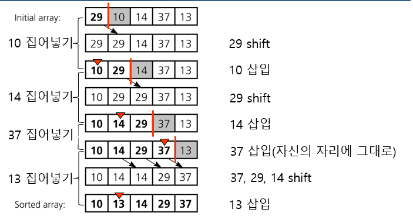
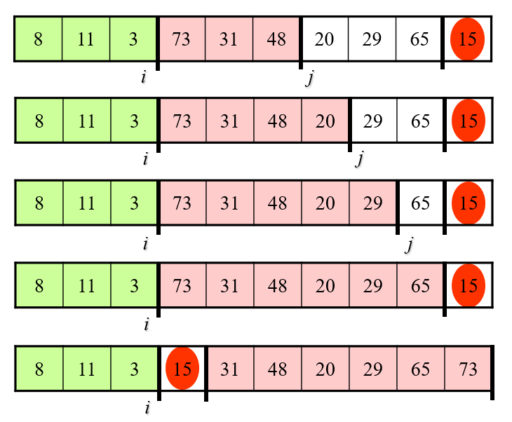
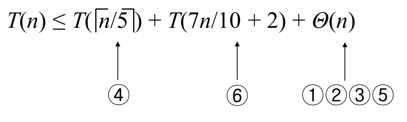

# Algorithm

# 개요

**Introduction To Algorithms 3rd Edition**를 바탕으로 수업시간에 다룬 내용들을 정리하였다. 지금은 수업시간에 다룬 내용을 바탕으로 작성하여 실제 책의 목차와는 다르다. 나중에 책을 바탕으로 따로 공부할 예정이다.

# 목차

[Algorithm Analysis](#Algorithm-Analysis)  
[Recurrence Formula and Algorithm Analysis](#Recurrence-Formula-and-Algorithm-Analysis)  
[Sorting](#Sorting)

# Algorithm Analysis

## 알고리즘

- 매개변수(parameter)는 문제에서 언급된 할당되지 않은 변수들이다.

  - 문제 : _단조증가 순서로 n개 정수의 리스트 S를 정리하시오._  
    매개변수 : `n`, `S`

- 실체(instance)는 매개변수에 실제로 할당된 값이다.

  - 문제 : _단조증가 순서로 n개 정수의 리스트 S를 정리하시오._  
    실체 : `n = 6`, `S = [10, 7, 11, 5, 13]`

- **알고리즘**이란 어떤 수학적으로 엄밀히 정의된 문제를 풀기 위한 **유한한 절차와 방법**이다.

## 알고리즘의 실험적 분석

- 주어진 알고리즘을 소스코드로 구현한 다음, 실제 환경에서 동작시켜 실제 실행 시간을 측정하여 분석한다.

  - C언어에서는 `clock()`이라는 함수를 이용해서 측정 가능하다.

- **실험적 분석의 문제점**

  - 알고리즘을 실제 구현해야한다.

  - 두 알고리즘의 성능을 비교할 때, 기본적으로 명시된 것들(하드웨어 사양) 및 측정할 수 없는 다양한 외부 요인들로 인해 정확한 비교가 힘들다.

## 알고리즘의 이론적 분석

- 알고리즘을 실제 수행 시간이 아닌, high-level에서 이론적으로 기술하는 방법이다.

- 시간은 보통 입력 사이즈에 관한 함수로 표현된다.

- 사용하는 **하드웨어 및 소프트웨어와 무관하게 알고리즘의 성능을 표현한다.**

- 이론적 분석을 통해 구한 알고리즘 수행 시간을 시간 복잡도라 한다.

- 단일 연산들(숫자를 변수에 대입, 두 정수 사이의 사칙 연산 등등)은 입력 크기와는 무관하게 **상수 시간**이 소모된다.

## Big-Oh notation

- 실제 성능에서 복잡한 알고리즘일수록 기본 연산들의 속도차이는 거의 무의미하고 **입력 사이즈에 비례해서 해당 함수가 어느 정도로 수행 시간이 증가하는가**가 중요하다.

- `Big-Oh notation`은 점근적 분석의 한 종류이다. 점근적 분석이란 입력의 크기가 충분히 큰 경우에 대해 분석하는 것이다.

- Big-Oh 표기법은 알고리즘의 소요시간이 입력크기 `n`에 대해 점근적 상한(최악의 경우)를 표시한다.

- `O(f(n))`은 점근적 증가율이 `f(n)`을 모든 함수의 집합이다.

  - 수학적으로 정의하자면, 모든 $n > n_0$ 에 대하여 $f(n) \geq c \cdot g(n)$ 를 만족하는 어떤 실수$c$와 자연수 $n_0$ 가 존재하면 **f(n) = O(g(n))** 이라고 한다.

  - 예를 들어, $5n^2 + 4n = O(n^2)$, $7n = O(n^2)$, $3n + 100 = O(3n + 100)$과 같이 사용할 수 있다. 하지만 방금 예시에서 $3n + 100 = O(3n + 100)$ 의 경우 정의에 의하면 맞다. 하지만 Big-Oh notation은 반드시 **제일 간략한 형태로 표현해야 한다.** 따라서 $O(n)$과 같이 표현해야 한다.

- Bih-Oh notation을 구현하는데 있어서 알아야할 규칙들이 있다.

  1. **함수의 각 term의 계수는 생략 가능하다.**

     - ex : $13n^2 = O(n^2)$

  2. **$n^a, n^b$ term이 같이 있을 때, $a > b$이면 $n^a$ term이 $n^b$ term을 dominates한다.**

     - ex : $n^4 + n^3 =  O(n^4)$

  3. **모든 지수함 term은 다항식을 dominate한다.**

     - ex : $1.00001^n$ dominates $(log n)^{1000000}$

  4. **모든 다항식 term은 로그 함수를 dominate한다.**

     - ex : $n$ dominates $(log n)^{100000000}$

- $n!$은 `Strling's approximation`에 의해 $O(n^n)$으로 취급한다.

- 다른 표기법으로 **Omega Notation**, **Theta Notation**이 있다.

- Omega Notation은 입력크기 `n`에 대해 적어도 걸리는 시간이다.

  - ex : $5n^2 + 4n = \Omega(n^2)$, $7n^3 = \Omega(n^2)$

- Theta Notation은 입력크기 `n`에 대해 평균적으로 걸리는 시간이다.

  - $\Theta(f(n))$은 점근적 증가율이 f(n)으로 일치하는 모든 함수의 집합이다.

## Example Basic arithmetic

- **n-bit binary number 곱하기**

  - Algorithm 1 : 인간이 곱셈을 하듯이 한 자리씩 차례로 곱해준다.  
    => n개의 bit를 n번 더하므로 $O(n^2)$

  - Algorithm 2 :

  1. 두 수 x, y를 곱한다 하자.집합 S를 둔다.
  2. y가 홀수이면 (x, y)를 집합S에 추가한다.
  3. x에 2를 곱하고 y를 2로 나눈다. 이 수에 대해 y가 홀수이면 (x, y)를 S에 추가한다.
  4. 과정 3을 Y = 1이 될 때까지 반복한다.
  5. 집합 s에 속한 순서쌍의 왼쪽에 있는 모든 숫자를 더한다.

     위의 알고리즘을 수학적 귀납법으로 증명하면 올바르게 작동한다는 것을 알 수 있다.

---

# Recurrence Formula and Algorithm Analysis

## Recurrence formula

- 점화식(Recurrence formula)는 수열의 항 사이에 성립하는 관계식이다.

- 점화식은 자기 호출을 사용하는 함수의 복잡도를 구하는데 유용하다. 점화식의 해가 곧 알고리즘의 시간 복잡도이다.

## Divide-and-conquer

- 재귀 호출을 다룰 때 분할 정복(Divide-and-conquer)을 이용하여 문제를 푼다.

- **분할** : 현재의 문제를 작은 단위(subproblem)으로 쪼갠다. subproblem은 본 문제와 같지만 입력 값이 더 작다.

- **정복** : 부분 문제를 재귀적으로 풀어 정복한다.

- **결합** : 부분 문제의 해를 결합해(combine, merge) 원래 문제의 해가 되도록 만든다.

- **Example : Merge sort**

  - **Problem** : Array `A = [3, 7, 2, 8, 6, 5, 9]`를 increasing order로 merge sort 하시오.

    **Subproblem**으로 쪼개기  
    A를 merge sort하시오. -> A1과 A2를 merge sort하시오. ->  
     ... -> array의 size가 1이 될 때 까지(Base case) 쪼개서 merge sort하시오.

    

    위의 그림과 같이 recursion을 통해 subproblem이 파생되는 모양을 그린 tree를 **recursion tree**라 한다.

    recrusion tree의 root는 원래 문제의 input이고, leaf node들은 base case의 input이며 크기가 1이다.

    **Subproblem의 답들을 merge하여 원래 input의 문제 해결**

    subproblem의 답을 이용하여 leaf-node에서부터 **recursion-tree를 거꾸로 올라가면서 답을 구한다.**

  - 수행시간 점화식 : $T(n) = 2T(\frac T 2) + cn$  
    => 크기가 `n`인 병합 정렬을 할 때 크기를 `n/2`인 병합 정렬을 두 번 수행하고 그 외에 상수시간만큼 후처리 시간이 든다.

## Algorithm Analysis

1. 점화식의 점근적 분석방법 - **반복대치**(**재귀 트리 방법**)

- 반복적으로 치환해서 점근적 복잡도를 구한다. **점화식을 각 노드가 재귀 호출의 해당 레벨에 따른 비용을 나타내도록 만든 트리로 변환하여 점화식을 푼다. 그리고 이를 위해 합의 한계를 구하는 기법을 이용한다.**

- merge sort를 반복대치로 분석해보자.  
  점근적 복잡도 계산의 용의를 위해 $n = 2^k$라고 가정하자. k는 recursion-tree의 높이이다. 결국 recursion tree는 input size만큼의 원소가 생기는 거의 완전 이진트리이다.(_leaf-node의 부모의 레벨에서만 자식이 1~2개를 가지고 나머지는 무조건 자식이 둘이다._) 따라서 $k = \log _2 n$이므로 $n = 2^k$와 같이 둬도 상관없다.
  $$
  T(n) = 2T(\frac n 2) + n\\
  = 2(2T(\frac n {2^2}) + \frac n 2) + n = 2^2T(\frac n {2^2}) + 2n\\
  = 2^3T(\frac n {2^3}) + 3n\\
  ...\\
  = 2^kT(\frac n {2^k} + kn)\\
  = n + n logn\\
  = O(nlogn)
  $$

2. 점화식의 점근적 분석방법 - **추정 후 증명**(**치환법**)

- **한계를 추측한 후 그 추측식을 증명하기 위해 수학적 귀납법을 이용한다.**

- merge sort를 추정 후 증명으로 분석해보자.  
  $T(n) = 2T(\frac n 2) + n$의 점근적 복잡도는 T(n) = O(n logn)이다. 즉 충분히 큰 n에 대해 $T(n) \leq cn logn$인 양의 상수 c가 존재한다.  
  경계 조건 : n = 2일 때 성립하는지 본다.  
  귀납적 가정 : $\frac n 2$에 대해 성립한다고 가정하자.  
  결론 : 충분히 큰 n에 대해 성립하는지 보자.
  $$
  T(n) = 2T(\frac n 2 + n)\\
  \leq 2c\frac n 2 log \frac n 2 + n(위에서 가정한 부분이다.)\\
  = cn logn - cnlog2 + n\\
  = cn logn +(-clog2 + 1)n\\
  \leq cn logn
  $$
  따라서 c가 $\frac 1 {log2}$보다 크다면 충분히 큰 n에 대해 성립한다.

3. 점화식의 점근적 분석방법 - **마스터 정리**

- $T(n) = aT(\frac n b) + f(n)$과 같은 모양을 가진 점화식에 대해 **마스터 정리**를 사용할 수 있다.

- 마스터 정리는 다음과 같다.  
  $n^{\log _b a} = h(n)$이라 하자.

  1. 어떤 양의 상수 $\epsilon$에 대하여 $\frac {f(n)} {h(n)} = O(\frac 1 {n^\epsilon})$이면, $T(n) = \Theta(h(n))$이다.

  2. 어떤 양의 상수 $\epsilon$에 대하여 $\frac {f(n)} {h(n)} = \Omega( n^\epsilon)$이고, 어떤 상수 c와 충분히 큰 모든 n에 대해 $af(\frac n b) \leq cf(n))$이면 $T(n) = \Theta(f(n))$이다.

  3. $\frac {f(n)} {h(n)} = \Theta(1)$이면 $T(n) = \Theta(h(n) log n)$이다.

- 위의 마스터 정리를 근사 버전으로 미적분을 배울 때 배우듯이 살펴보면,

  1. f(n)의 차수가 더 크면 $T(n) = \Theta(h(n))$이다.

  2. h(n)의 차수가 더 크고, 충분히 큰 모든 n에 대해 $af(\frac n b) \leq cf(n))$이면 $T(n) = \Theta(f(n))$이다.

  3. $\frac {f(n)} {h(n)} = \Theta(1)$이면 $T(n) = \Theta(h(n) log n)$이다.

- 즉 직관적인 의미로 다시 해석해보자.

  1. h(n)이 더 무거우면 h(n)이 수행 시간을 결정한다.

  2. f(n)이 더 무거우면 f(n)이 수행 시간을 결정한다.

  3. h(n)과 f(n)이 같은 무게이면, h(n)과 log n의 곱이 수행 시간이 된다.

---

# Sorting

## 정렬 알고리즘

- | 알고리즘  | 최악의 경우 수행시간 | 평균 수행시간       |
  | --------- | -------------------- | ------------------- |
  | 삽입 정렬 | $\Theta(n^2)$        | $\Theta(n^2)$       |
  | 병합 정렬 | $\Theta(n \log n)$   | $\Theta(n \log n)$  |
  | 힙 정렬   | $O(n \log n)$        | ----                |
  | 퀵 정렬   | $\Theta(n^2)$        | $\Theta(n \log n)$  |
  | 계수 정렬 | $\Theta (k + n)$     | $\Theta (k + n)$    |
  | 기수 정렬 | $\Theta (d(n + k))$  | $\Theta (d(n + k))$ |
  | 버킷 정렬 | $\Theta(n^2)$        | $\Theta (n)$        |

## Basic Sorting Algorithms

- **선택정렬(Selection Sort)**

  - 가장 간단하다.

  - 최대 원소를 찾고, 최대 원소를 제일 뒤로 보내는 것을 반복하면서 정렬한다.

  - `for`루프를 $(n-1) + (n-2) + (n-3) + ... + 2 + 1$ 과 같이 반복한다. 따라서 $\frac {n(n-1)} 2 = \Theta (n^2)$ 이다.

- **버블정렬(Bubble Sort)**

  - 최대 원소를 제일 뒤로 보내는 것은 같지만, 이웃한 원소와 계속 비교하면서 순서가 잘못되어있으면 교환한다.

  - 시간복잡도는 선택정렬과 같다.

- **삽입정렬(Insertion Sort)**

  - 이미 정렬된 배열에 정렬되지 않은 배열의 원소를 하나씩 더해서 정렬된 배열 하나로 만든다.

  - `arr = [29, 10, 14, 37, 13]`을 정렬해보자.

    1. 정렬된 배열 `res`에 `29` 삽입  
       `res = [29, null]`

    2. `res`에 `10` 삽입  
       `res = [10, 29]`

    3. `res`에 `14` 삽입
       `res = [10, 14, 29]`

    ... 위의 과정을 반복한다. 실제로는 값이 복사되면서 삽입되는데, 아래의 그림을 참고하자.

    

  - 시간 복잡도는 배열이 역으로 정렬되어있는  
    **Worst case**에서 $1 + 2 + ... + (n-2) + (n-1) = \Theta(n^2)$  
    배열이 이미 정렬되어있는  
    **Best case**에서 $1 + 1 + ... + 1 = \Theta(n)$  
    따라서 **Average case**에서 $\frac {n^2 + n} 2 = \Theta (n^2)$

## 병합정렬(Merge Sort)

- merge sort는 위에서 다루었기에 마스터 정리에 의해 시간 복잡도가 $\Theta(n\log n)$ 인 것만 알아두자.

## 퀵정렬(Quick Sort)

- 평균적으로 가장 좋은 성능을 가졌다. 기준 원소를 잡고 기준 원소를 기준으로 양쪽으로 재배치하면서 정렬한다.

- 퀵정렬 또한 **Divide-and-conquer**을 이용한다.

  - **분할** : 배열 `A[p .. r]`을 두 개의 부분 배열 `A[p .. q - 1]` `A[q + 1 .. r]`로 분할한다. 전자는 `A[q]`보다 작거나 같은 원소를, 후자는 `A[q]`보다 크거나 같은 원소를 배치한다.

  - **정복** : 퀵 정렬을 재귀 호출해서 두 부분 배열을 정렬한다.

  - **결합** : 부분 배열이 이미 정렬되어 있으므로 저절로 합쳐져 있다.

- ```
    QUICKSORT(A, p, r)
      if(p < r)
        q = PARTITION(Am p, r)
        QUICKSORT(A, p, q-1)
        QUICKSORT(A, q+1, r)
  ```

  이 때 `PARTITION`은 쉽게 말해 배열 `A`의 원소들을 `A[r]`을 기준으로 양쪽으로 재배치하고 `A[r]`의 위치를 리턴하는 함수이다.

  ```
  PARTITION(A, p, r)
    x = A[r]
    i = p - 1
    for(j = p; j < r; j++)
      if(A[j] <= x)
        i++;
        SWAP(A[i], A[j])
    SWAP(A[i+1], A[r])
    return i + 1
  ```

  위의 `PARTITION`이 정확하게 작동하는 모습을 한 스텝만 보자.

  
  

- **시간 복잡도**

  - **평균 수행 시간** : 가장 이상적인 경우로, 분할이 항상 반반씩 균등될 때  
    $T(n) = 2T(\frac n 2) + n => \Theta (n \log n)$

  - **최악의 경우 수행 시간** : 이미 정렬이 되어 한 쪽에 다 몰리도록 분할되는 경우  
    $T(n) = T(n-1) + \Theta (n) => \Theta(n^2)$

## 힙 정렬(Heap Sort)

- 주어진 배열을 힙으로 만들고, 차례로 하나씩 힙에서 제거함으로써 정렬한다.

  - **힙**이란 Complete binary tree로서 각 노드의 값은 자신의 children보다 크지 않다.

  - 힙은 배열로 표현될 수 있으며, `A[k]`의 자식은 `A[2k]`, `A[2k+1]`이고 `A[k]`의 부모는 `A[2/k]`의 내림이 된다.

- **힙 정렬 알고리즘**

  - ```C
    heapSort(A[], n){
      buildHeap(A, n);
      for(i=n;i > 1;i--){
        SWAP(A[1], A[i]);
        heapify(A, 1, i-1);
      }
    }
    ```

    `buildHeap`을 통해 힙을 만들고, `heapify`를 통해 첫 번째 노드를 삭제한 후 힙 특성을 유지하도록 수정하는 과정을 거친다.

    ```C
    buildHeap(A[], n){
      for(i=floor(2/n);i > 0;i--)
        heapify(A, i, n);
    }
    ```

    A[k]를 루트로하는 트리를 힙 성질에 맞도록 수정하는 `heapify`도 보자.

    ```C
    heapify(A[], r, n){
      left = 2k, right = 2k - 1;
      if(right <= n){
        if(A[left] < A[right]) smaller = left;
        else smaller = right;
      }
      //A[k]가 왼쪽 자식만 가지는 경우
      else if(left <= n) smaller = left;
      //A[k]가 리프노드인 경우
      else return;

      if(A[smaller] < A[k]){
        SWAP(A[k], A[smaller]);
        //A[k]의 자식에 대하여 heapify호출
        heapify(A, smaller, n);
      }
    }
    ```

    => `buildHeap`은 $O(\log n)$이 걸리는 `heapify`를 `floor(n/2)`번 호출하므로 $O(n \log n)$이다.

## 비교정렬 시간의 하한

- 원소끼리 비교하는 것으로 정렬하는 방법을 위해서는 아래의 **결정 트리**와 같이 `n!`개의 리프노드가 필요하다.
  

  - **결정 트리 모델**은 주어진 입력에 대해서 특정 정렬 알고리즘에 의해 수행되는 원소들의 비교를 표현하는 포화 이진 트리이다. 비교 정렬 알고리즘에서 최악의 경우 비교 횟수는 그에 대응되는 결정 트리의 높이와 같다.

- 원소 `n`개에 대한 비교 정렬에 대응하는 높이가 `h`고 도달 가능한 리프가 `l`개인 결정 트리르 생각해보자. 입력을 순열로 배치하는 경우의 수가 `n!`이고 각 순열은 하나의 리프이므로 $n! \leq l$이어야 한다. 높이가 `h`인 이진 트리의 리프 개수는 $2^h$를 넘을 수 없으므로(포화 이진 트리의 리프 노드 개수가 $2^h$ 이므로) 다음의 등식을 만족한다.  
   **$n! \leq l \leq 2^h$**  
  양변에 로그를 취하면 $h \geq lg(n!) = \Omega (n lgn)$이다.  
  **결론은 비교를 사용한 정렬 방법의 하한선은 $\Omega (n \log n)$이라는 것이다.**

## 기수정렬(Radix Sort)

- 모든 입력값이 `K`자리 수 이하인 자연수인 특수한 겨웅에만 사용이 가능하다.

- 10진수라면 각 열은 10개의 장소를 사용하여, 가장 낮은 자리부터 숫자를 차례대로 통에 담으면서 정렬한다.

- `O(n)`의 점근도 값을 갖는다.

## 계수정렬(Counting Sort)

- 원소의 값이 한정적으로 `1 ~ k`의 자연수로 제한되어 있는 경우 사용 가능하다.

- 배열의 원소를 훑어보고 `1 ~ k`의 자연수가 몇 번 등장하는지 센다. 이를 기준으로 `A[1...n]`에 값을 할당한다.

  - 예를 들어 `x`보다 작은 원소가 17개라면 `x`를 18번째 자리에 위치시킨다.

- `n`개의 입력 원소가 각각 0부터 `k`사이에 있는 정수라 할 때 `k = O(n)`일 때 계수 정렬은 $\Theta (n)$에 수행된다.

# Selection Algorithm with Linear Time Complexity

## 선형적인 평균 수행시간에 선택하기

- 배열 `A[p .. r]`에서 `i`번쨰 작은 원소를 평균 선형시간에 찾는 원소이다.
  ```C
  select(A, p, r, i){
    //원소가 하나뿐인 경우
   if(p == r) return A[p];
   q = partition(A, p, r);
   k = q - p + 1; //k는 기준원소(pivot)가 전체에서 k번째 작은 원소임을 의미한다.
   //i가 왼쪽에 있는 경우 왼쪽 탐색
   if(i < k) return select(A, p, q-1, i);
   else if(i == k) return A[q];
   else return select(A, p, q-1, i-k);
  }
  ```
  `Quick Sort`와 비슷한 구조를 가지며, 차이점은 `i`번째 작은 원소가 존재하는 곳만 구역으로 잡아 탐색한다는 것이다. 시간 복잡도는 평균 $\Theta(n)$, 최악의 경우 $\Theta (n^2)$이다.

## 선형시간 선택 알고리즘 수행 시간 분석

- $T(n) \leq max[T(k-1), T(n-k)] + \Theta (n)$

  - 분할된 양쪽 중 큰 쪽을 처리하는 비용과, 분할을 하는 비용 $\Theta (n)$이 든다.

- 위의 시간에 기댓값을 취하여 평균 수행 시간을 계산하여, 귀납적 가설을 이용하여 선형시간 선택 평균 수행 시간을 계산할 수 있다. 자세한 증명은 책을 참고하자.

- 결론적으로 평균 수행 시간은 **O(n)** 이 나온다.

- 하지만 분할 균형이 깨져 계속 한 쪽으로 몰리는 최악의 경우에는 $\Theta (n^2)$ 이 나온다.

## 최악의 경우에도 선형 시간을 보장하는 알고리즘

- 앞에서 배운 알고리즘은 분할의 균형에 영향을 받는다.

- 최악의 경우 분할의 균형이 어느정도 보장되도록하는 **Select** 알고리즘을 살펴보자.

  1. `n`개 짜리 입력이 5 이하이면 그냥 찾고 끝낸다.

  2. 전체 원소들을 5개씩 그룹으로 나눈다. `n`이 5의 배수가 아니면 마지막 그룹은 `n mod 5`개를 가진다.

  3. 각 그룹에서 중앙값을 찾는다. 이 때 각 그룹을 삽입정렬한다.

  4. `SELECT`을 재귀적으로 사용해 중앙값들의 중앙값을 구한다. 원소의 총 수가 짝수인 경우 작은 중앙값으로 한다.

  5. `PARTITION`을 호출하여 중앙값들의 중앙값 `M`을 기준으로 배열을 분할한다.

  6. `SELECT`를 재귀적으로 호출하여 적합한 쪽을 선택하여 반복한다.

- 이 때 최악의 분할의 경우 `M`보다 큰 원소 개수의 하한을 구하자. 3단계에서 구한 중앙값들의 절반은 **적어도 `M`보다 크거나 같다.** 그러므로 원소 수가 5개보다 작은 그룹과 `x`가 포함된 그룹을 제외한 그룹 중에서 **적어도 절반은 `M`보다 큰 원소가 3개 있다.** 따라서 최악의 분할의 경우에도 `M`보다 큰(작은) 원소 수는 **3n/10 - 6**이다.

- **각 단계별 알고리즘 분석**

  1. `n`개 짜리 입력이 5 이하이면 그냥 찾고 끝낸다.

     - **상수시간**

  2. 전체 원소들을 5개씩 그룹으로 나눈다. `n`이 5의 배수가 아니면 마지막 그룹은 `n mod 5`개를 가진다.

     - 각 원소를 지나가면서 그룹만 정해주면 되므로 **O(n)**

  3. 각 그룹에서 중앙값을 찾는다. 이 때 각 그룹을 삽입정렬한다.

     - 중앙값을 찾는데 상수시간이 들고, 이를 그룹의 개수인 `ceil(n/5)`번 하므로 **O(n)**

  4. `SELECT`을 재귀적으로 사용해 중앙값들의 중앙값을 구한다. 원소의 총 수가 짝수인 경우 작은 중앙값으로 한다.

     - 그룹의 개수를 입력 사이즈로 재귀호출 하므로 **T(ceil(n/5))**

  5. `PARTITION`을 호출하여 중앙값들의 중앙값 `M`을 기준으로 배열을 분할한다.

     - Quick Sort와 비슷하게 분할하므로 **O(n)**

  6. `SELECT`를 재귀적으로 호출하여 적합한 쪽을 선택하여 반복한다.

     - `n - 최악으로 분할된 원소의 수`를 입력 사이즈로 재귀호출 하므로 **T(7n/10 + 6)**

  - 따라서 위의 내용들을 정리하면 시간 복잡도에 대한 점화식은 아래와 같다.
      
    그리고 추정 후 증명법을 통해  
    **T(n) = O(n)** 임을 증명할 수 있고, **$T(n) = \Omega (n)$** 는 자명하므로 **$T(n) = \Theta (n)$** 이다.
