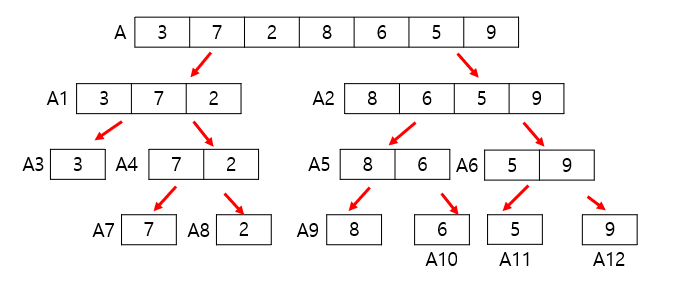

# Algorithm

# 개요

**Introduction To Algorithms 3rd Edition**를 바탕으로 수업시간에 다룬 내용들을 정리하였다. 지금은 수업시간에 다룬 내용을 바탕으로 작성하여 실제 책의 목차와는 다르다. 나중에 책을 바탕으로 따로 공부할 예정이다.

# 목차

[Algorithm Analysis](#Algorithm-Analysis)

# Algorithm Analysis

## 알고리즘

- 매개변수(parameter)는 문제에서 언급된 할당되지 않은 변수들이다.

  - 문제 : _단조증가 순서로 n개 정수의 리스트 S를 정리하시오._  
    매개변수 : `n`, `S`

- 실체(instance)는 매개변수에 실제로 할당된 값이다.

  - 문제 : _단조증가 순서로 n개 정수의 리스트 S를 정리하시오._  
    실체 : `n = 6`, `S = [10, 7, 11, 5, 13]`

- **알고리즘**이란 어떤 수학적으로 엄밀히 정의된 문제를 풀기 위한 **유한한 절차와 방법**이다.

## 알고리즘의 실험적 분석

- 주어진 알고리즘을 소스코드로 구현한 다음, 실제 환경에서 동작시켜 실제 실행 시간을 측정하여 분석한다.

  - C언어에서는 `clock()`이라는 함수를 이용해서 측정 가능하다.

- **실험적 분석의 문제점**

  - 알고리즘을 실제 구현해야한다.

  - 두 알고리즘의 성능을 비교할 때, 기본적으로 명시된 것들(하드웨어 사양) 및 측정할 수 없는 다양한 외부 요인들로 인해 정확한 비교가 힘들다.

## 알고리즘의 이론적 분석

- 알고리즘을 실제 수행 시간이 아닌, high-level에서 이론적으로 기술하는 방법이다.

- 시간은 보통 입력 사이즈에 관한 함수로 표현된다.

- 사용하는 **하드웨어 및 소프트웨어와 무관하게 알고리즘의 성능을 표현한다.**

- 이론적 분석을 통해 구한 알고리즘 수행 시간을 시간 복잡도라 한다.

- 단일 연산들(숫자를 변수에 대입, 두 정수 사이의 사칙 연산 등등)은 입력 크기와는 무관하게 **상수 시간**이 소모된다.

## Big-Oh notation

- 실제 성능에서 복잡한 알고리즘일수록 기본 연산들의 속도차이는 거의 무의미하고 **입력 사이즈에 비례해서 해당 함수가 어느 정도로 수행 시간이 증가하는가**가 중요하다.

- `Big-Oh notation`은 점근적 분석의 한 종류이다. 점근적 분석이란 입력의 크기가 충분히 큰 경우에 대해 분석하는 것이다.

- Big-Oh 표기법은 알고리즘의 소요시간이 입력크기 `n`에 대해 점근적 상한(최악의 경우)를 표시한다.

- `O(f(n))`은 점근적 증가율이 `f(n)`을 모든 함수의 집합이다.

  - 수학적으로 정의하자면, 모든 $n > n_0$ 에 대하여 $f(n) \geq c \cdot g(n)$ 를 만족하는 어떤 실수$c$와 자연수 $n_0$ 가 존재하면 **f(n) = O(g(n))** 이라고 한다.

  - 예를 들어, $5n^2 + 4n = O(n^2)$, $7n = O(n^2)$, $3n + 100 = O(3n + 100)$과 같이 사용할 수 있다. 하지만 방금 예시에서 $3n + 100 = O(3n + 100)$ 의 경우 정의에 의하면 맞다. 하지만 Big-Oh notation은 반드시 **제일 간략한 형태로 표현해야 한다.** 따라서 $O(n)$과 같이 표현해야 한다.

- Bih-Oh notation을 구현하는데 있어서 알아야할 규칙들이 있다.

  1. **함수의 각 term의 계수는 생략 가능하다.**

     - ex : $13n^2 = O(n^2)$

  2. **$n^a, n^b$ term이 같이 있을 때, $a > b$이면 $n^a$ term이 $n^b$ term을 dominates한다.**

     - ex : $n^4 + n^3 =  O(n^4)$

  3. **모든 지수함 term은 다항식을 dominate한다.**

     - ex : $1.00001^n$ dominates $(log n)^{1000000}$

  4. **모든 다항식 term은 로그 함수를 dominate한다.**

     - ex : $n$ dominates $(log n)^{100000000}$

- $n!$은 `Strling's approximation`에 의해 $O(n^n)$으로 취급한다.

- 다른 표기법으로 **Omega Notation**, **Theta Notation**이 있다.

- Omega Notation은 입력크기 `n`에 대해 적어도 걸리는 시간이다.

  - ex : $5n^2 + 4n = \Omega(n^2)$, $7n^3 = \Omega(n^2)$

- Theta Notation은 입력크기 `n`에 대해 평균적으로 걸리는 시간이다.

  - $\Theta(f(n))$은 점근적 증가율이 f(n)으로 일치하는 모든 함수의 집합이다.

## Example Basic arithmetic

- **n-bit binary number 곱하기**

  - Algorithm 1 : 인간이 곱셈을 하듯이 한 자리씩 차례로 곱해준다.  
    => n개의 bit를 n번 더하므로 $O(n^2)$

  - Algorithm 2 :

  1. 두 수 x, y를 곱한다 하자.집합 S를 둔다.
  2. y가 홀수이면 (x, y)를 집합S에 추가한다.
  3. x에 2를 곱하고 y를 2로 나눈다. 이 수에 대해 y가 홀수이면 (x, y)를 S에 추가한다.
  4. 과정 3을 Y = 1이 될 때까지 반복한다.
  5. 집합 s에 속한 순서쌍의 왼쪽에 있는 모든 숫자를 더한다.

     위의 알고리즘을 수학적 귀납법으로 증명하면 올바르게 작동한다는 것을 알 수 있다.

---

# Recurrence Formula and Algorithm Analysis

## Recurrence formula

- 점화식(Recurrence formula)는 수열의 항 사이에 성립하는 관계식이다.

- 점화식은 자기 호출을 사용하는 함수의 복잡도를 구하는데 유용하다. 점화식의 해가 곧 알고리즘의 시간 복잡도이다.

## Divide-and-conquer

- 재귀 호출을 다룰 때 분할 정복(Divide-and-conquer)을 이용하여 문제를 푼다.

- **분할** : 현재의 문제를 작은 단위(subproblem)으로 쪼갠다. subproblem은 본 문제와 같지만 입력 값이 더 작다.

- **정복** : 부분 문제를 재귀적으로 풀어 정복한다.

- **결합** : 부분 문제의 해를 결합해(combine, merge) 원래 문제의 해가 되도록 만든다.

- **Example : Merge sort**

  - **Problem** : Array `A = [3, 7, 2, 8, 6, 5, 9]`를 increasing order로 merge sort 하시오.

    **Subproblem**으로 쪼개기  
    A를 merge sort하시오. -> A1과 A2를 merge sort하시오. ->  
     ... -> array의 size가 1이 될 때 까지(Base case) 쪼개서 merge sort하시오.

    

    위의 그림과 같이 recursion을 통해 subproblem이 파생되는 모양을 그린 tree를 **recursion tree**라 한다.

    recrusion tree의 root는 원래 문제의 input이고, leaf node들은 base case의 input이며 크기가 1이다.

    **Subproblem의 답들을 merge하여 원래 input의 문제 해결**

    subproblem의 답을 이용하여 leaf-node에서부터 **recursion-tree를 거꾸로 올라가면서 답을 구한다.**

  - 수행시간 점화식 : $T(n) = 2T(\frac T 2) + cn$  
    => 크기가 `n`인 병합 정렬을 할 때 크기를 `n/2`인 병합 정렬을 두 번 수행하고 그 외에 상수시간만큼 후처리 시간이 든다.

## Algorithm Analysis

1. 점화식의 점근적 분석방법 - **반복대치**(**재귀 트리 방법**)

- 반복적으로 치환해서 점근적 복잡도를 구한다. **점화식을 각 노드가 재귀 호출의 해당 레벨에 따른 비용을 나타내도록 만든 트리로 변환하여 점화식을 푼다. 그리고 이를 위해 합의 한계를 구하는 기법을 이용한다.**

- merge sort를 반복대치로 분석해보자.  
  점근적 복잡도 계산의 용의를 위해 $n = 2^k$라고 가정하자. k는 recursion-tree의 높이이다. 결국 recursion tree는 input size만큼의 원소가 생기는 거의 완전 이진트리이다.(_leaf-node의 부모의 레벨에서만 자식이 1~2개를 가지고 나머지는 무조건 자식이 둘이다._) 따라서 $k = \log _2 n$이므로 $n = 2^k$와 같이 둬도 상관없다.
  $$
  T(n) = 2T(\frac n 2) + n\\
  = 2(2T(\frac n {2^2}) + \frac n 2) + n = 2^2T(\frac n {2^2}) + 2n\\
  = 2^3T(\frac n {2^3}) + 3n\\
  ...\\
  = 2^kT(\frac n {2^k} + kn)\\
  = n + n logn\\
  = O(nlogn)
  $$

2. 점화식의 점근적 분석방법 - **추정 후 증명**(**치환법**)

- **한계를 추측한 후 그 추측식을 증명하기 위해 수학적 귀납법을 이용한다.**

- merge sort를 추정 후 증명으로 분석해보자.  
  $T(n) = 2T(\frac n 2) + n$의 점근적 복잡도는 T(n) = O(n logn)이다. 즉 충분히 큰 n에 대해 $T(n) \leq cn logn$인 양의 상수 c가 존재한다.  
  경계 조건 : n = 2일 때 성립하는지 본다.  
  귀납적 가정 : $\frac n 2$에 대해 성립한다고 가정하자.  
  결론 : 충분히 큰 n에 대해 성립하는지 보자.
  $$
  T(n) = 2T(\frac n 2 + n)\\
  \leq 2c\frac n 2 log \frac n 2 + n(위에서 가정한 부분이다.)\\
  = cn logn - cnlog2 + n\\
  = cn logn +(-clog2 + 1)n\\
  \leq cn logn
  $$
  따라서 c가 $\frac 1 {log2}$보다 크다면 충분히 큰 n에 대해 성립한다.

3. 점화식의 점근적 분석방법 - **마스터 정리**

- $T(n) = aT(\frac n b) + f(n)$과 같은 모양을 가진 점화식에 대해 **마스터 정리**를 사용할 수 있다.

- 마스터 정리는 다음과 같다.  
  $n^{\log _b a} = h(n)$이라 하자.

  1. 어떤 양의 상수 $\epsilon$에 대하여 $\frac {f(n)} {h(n)} = O(\frac 1 {n^\epsilon})$이면, $T(n) = \Theta(h(n))$이다.

  2. 어떤 양의 상수 $\epsilon$에 대하여 $\frac {f(n)} {h(n)} = \Omega( n^\epsilon)$이고, 어떤 상수 c와 충분히 큰 모든 n에 대해 $af(\frac n b) \leq cf(n))$이면 $T(n) = \Theta(f(n))$이다.

  3. $\frac {f(n)} {h(n)} = \Theta(1)$이면 $T(n) = \Theta(h(n) log n)$이다.

- 위의 마스터 정리를 근사 버전으로 미적분을 배울 때 배우듯이 살펴보면,

  1. f(n)의 차수가 더 크면 $T(n) = \Theta(h(n))$이다.

  2. h(n)의 차수가 더 크고, 충분히 큰 모든 n에 대해 $af(\frac n b) \leq cf(n))$이면 $T(n) = \Theta(f(n))$이다.

  3. $\frac {f(n)} {h(n)} = \Theta(1)$이면 $T(n) = \Theta(h(n) log n)$이다.

- 즉 직관적인 의미로 다시 해석해보자.

  1. h(n)이 더 무거우면 h(n)이 수행 시간을 결정한다.

  2. f(n)이 더 무거우면 f(n)이 수행 시간을 결정한다.

  3. h(n)과 f(n)이 같은 무게이면, h(n)과 log n의 곱이 수행 시간이 된다.
