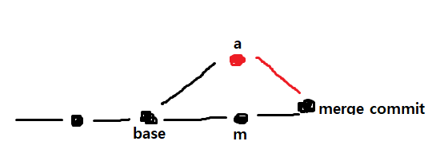

[호눅스](https://github.com/honux77/practice/wiki/learngit)님의 깃허브를 참고하여 공부하였다.

[영상 강의](https://opentutorials.org/course/3838)

  - https://opentutorials.org/course/3838

[참고서](https://backlog.com/git-tutorial/kr/)

  - https://backlog.com/git-tutorial/kr/

[교재](https://git-scm.com/book/ko/v2)

  - https://git-scm.com/book/ko/v2

## 22.09.26

# Git - 버전관리

## 버전 생성

- 프로젝트 파일에 들어가서 `git init .`을 통해 버전 관리를 시작한다. `.git`이라는 파일이 생기고 이 파일이 버전 정보를 기록한다.

- 파일들은 **Working tree**, **Staging Area**, **Repasitory**로 나뉜다.

  - **Working tree**는 작업한 파일들이고 그 중 버전을 만들 파일들을 **Staging Area**에 올린다.  
  그리고 그 파일들을 git이 버전으로 만들어서 **Repasitory**에 올린다.

- `git config --global core.editor "nano"` : git의 기본 에디터를 나노로 변경한다. 익숙치않은 에디터가 나오지 않게하기위해 사용한다.
 `git status` : Working tree의 상태를 볼 수 있다.    
 `git add` : Staging Area에 올릴 수 있다.  
 `git commit` : 버전을 생성할 수 있다.  
 `git log` : 버전들을 볼 수 있다.  
 `git log --stat` : 어떤 파일들이 commit 되었는지(버전관리 대상에 포함되었는지) 볼 수 있다. 이런 옵션들은 구글링으로 해결하자.  
 `git diff` : 이전 버전에 대해 수정사항을 보여준다.  
 `git log -p` : 이전 버전에 대한 수정사항을 파일별로 더 자세히 보여준다.  
 `git commit -am` : 모든 파일들을 add하면서 commit한다. 단, Untracked 파일이 있으면 실행이 안되므로 한 번도 add하지 않은 파일은 안된다.  
 
- 한 번도 `add`하지 않은 파일의 status는 *Untracked*라고 표시된다. 아직 Staging Area에 없어서 git이 인식할 수 없다는 뜻이다.    
 한 번이라도 `add`한 파일의 status는 *Changes not staged*라고 표시된다. 수정사항이 Staging Area에 안올라갔다는 뜻이다.

## 버전 변경

- git log를 해보면 `(HEAD -> Master)`라는 표시와 버전별 `commit id`가 뜬다. 헤드가 Master노드를 가리키고 있다는 뜻이다.

- `git checkout commit id` : 특정 commit 버전으로 되돌아간다. `git checkout master`로 원래대로 돌아올 수 있다.

## 22.09.30

## 버전 삭제

- `git 명령어 --help` : 명령어에 대한 도움말을 볼 수 있다.

- `git reset --hard commit id` : `commit id`로 버전을 리셋한다. 해당 commit id를 리셋하는것이 아님을 주의하자. 
	hard옵션을 쓰면 우리가 수정하고 있던 것 모두 삭제한다. 즉 `commit id`의 버전으로 코드가 돌아가는 것이다.
  
  - 수정하던것을 놔두고 삭제하려면 다른 옵션을 사용하면 된다.
  
 
## 버전 되돌리기

- `git revert commit id` : `commit id`의 수정사항을 모두 제거한 버전을 새로 생성한다. 새로 생성된 버전은 `commit id` 이전 버전의 코드이며  
 새로운 버전을 생성하는 것이므로 커밋 메시지를 작성해줘야한다. 단, **한 단계씩 되돌아가야 한다.**
 
  - Example  
  ###
  **git log**  
  ```
  commit 4(commit id) message R4
  commit 3(commit id) message R3
  commit 2(commit id) message R2
  commit 1(commit id) mesaage R1
  ```
    **git revert 4**
  ```
  commit 5(commit id) mesaage Revert R4
  commit 4(commit id) message R4
  commit 3(commit id) message R3
  commit 2(commit id) message R2
  commit 1(commit id) mesaage R1
  ...
  ```  
  R4를 revert했더니 R3의 내용을 가지고있는 새로운 버전(5)이 생성되었다. 즉 버전의 보존과 동시에 내가 원하는 버전으로 되돌아 간 것이다.  
  
  
  - R1으로 되돌아가고 싶다고 **git revert 2**를 하게되면 충돌이 일어난다. 따라서 꼭 순차적으로 **git revert 3**, **git revert 2**와 같이 해줘야 한다.  
  그 이유는 git revert 2는 현재 버전에서 버전2에서 생긴 변화를 제거하고 그 버전을 생성하는 것이다.  
  그래서 바로 git revert 2를 하게되면 버전2 이후에 생긴 변화인 버전3을 제대로 인식하지 못해서 충돌이 일어난다.
  
# Git - Branch & Confilict

## Branch의 기본 사용법

- `git log --all` : 모든 브랜치의 git log를 볼 수 있다.  
  `git log -- oneline` : git log를 한 줄로 볼 수 있다.  
  `git log --graph` : git log를 그래프 형태로 볼 수 있다.  
  `git branch` : 현재 만들어진 branch를 볼 수 있다. 현재 브랜치는 앞에 \*이 붙고 기본적으로 master브랜치가 생성되어 있다.  
  `git branch branch name` : branch name의 이름을 가진 브랜치를 생성한다.  
  `git checkout branch name` : branch name의 브랜치로 이동한다.
  
  - Example  
  work 1 커밋에서는 빈 파일에 *content 1*이 추가된다.  
  work 2 커밋에서는 위의 파일에 *content 2*가 추가된다.  
  work 3 커밋에서는 위의 파일에 *content 3*가 추가된다. 
  ###
  
    **git log --all --graph --oneline**  
    ```
    3 (HEAD -> master) work 3
    2 work 2
    1 work 1
    ```  
	
	**git branch**
	```
	* master
	```  
	
	**git branch apple**  
	**git log --all --graph --oneline**  
	```
	3 (HEAD -> master, apple) work 3
    2 work 2
    1 work 1
	```
	
    **git branch google**  
	**git log --all --graph --oneline**  
	```
	3 (HEAD -> master, apple, google) work 3
    2 work 2
    1 work 1
	```
    이 때 apple, google 브랜치 모두 work 3 상태에서 만들어서 같은 커밋을 공유한다.  
	그리고 마스터 브랜치에서 파일에 contnet 4를 추가하고 add, commit했다고 하자.  
	###
	**git log --all --graph --onelin**
	```
	4 (HEAD -> master) work 4
	3 (apple, google) work 3
    2 work 2
    1 work 1
	```
	
	**git checkout apple**  
	**git log --all --graph --onelin**  
	```
	4 (master) work 4
	3 (HEAD -> apple, google) work 3
    2 work 2
    1 work 1
	```
	git checkout을 하면 위와같이 로그가 바뀌고 **파일의 내용 또한 apple의 마지막 커밋 상태로 돌아가게 된다.** 즉 content4가 사라진다.  
	나는 브랜치를 멀티 유니버스 정도로 이해하고 있다. git branch branch name을 할 때 마다 새로운 유니버스가 생성되고 checkout을 하면 다른 유니버스로 이동한다고 이해하였다.
	
##  브랜치 병합

- master브랜치에서 작업을 하다가 a브랜치를 만들어서 작업을 하고 커밋을 하였다. 또 마스터 브랜치에서도 작업을 계속 하고 커밋을 하였다.  
 그런데 이 다른 두 브랜치를 한 브랜치로 병합하고싶다. 이 때 a브랜치와 마스터 브랜치의 공통 조상 브랜치를 **base branch**라고 한다.  
 합치고 난 후의 브랜치를 **merge commit**라고 한다.  
 ###
 
  
 
## 3 way merge

- 두 브랜치를 병합하는 과정에서 충돌이 일어날 수 있다. 처음에는 병합하려는 두 브랜치의 수정사항을 비교해서 공통 부분만 병합하고 아닌 부분은 충돌로 처리하였고  
 이 방법을 **2 way merge**라고 하였다.

- **3 way merge**는 베이스 브랜치도 이용하여 병합하려는 두 브랜치 수정사항이 일치하지 않는다면, **베이스 브랜치에서 수정한 부분으로 병합하는 방법이다.**   
 물론 두 브랜치 모두에서 수정을 한 부분이 있다면 충돌로 처리한다.  
 ###
 | **a** 	| **base** 	| **b** 	| **2 way merge** 	| **3 way merge** 	|
|----------------	|-----------------	|-----------------	|-----------------	|-----------------	|
| A              	| A               	| A               	| A               	| A               	|
| H              	| B               	| B               	|        ?        	| H               	|
| C              	| C               	| T               	|        ?        	| T               	|
| H              	| D               	| T               	|        ?        	|        ?        	|
 
 